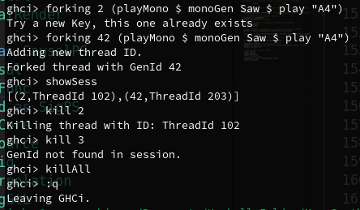

# MonaSynthLib

This file outlines the structure of your `MonaSynthLib` library, including the key modules, usage examples, and project setup.

## Project Structure:

app/
  MonaSynthLib/
    Generators.hs
    Play.hs
    Notes.hs
    Filters.hs
    Mixers.hs
    Sampling.hs
    Multithreading.hs
  MonaSynthLib.hs

 The last File imports all modules in the dir: `MonaSynthLib`.

## Dependencies

MonaSynthLib relies on the following external libraries:

    llvm-ffi
    synthesizer-llvm
    llvm-tf
    sox    
    ... and some more, but these are critical

## Module Description

**Generators**: Creates waveforms like sine, square, and sawtooth with for various sound textures.

**Play**: Manages playback of generated sounds with real-time audio rendering.

**Notes**: Defines musical notes table and lookup function.

**Filters**: Provides filters (low-pass, high-pass) to shape waveforms.

**Mixers**: Mix and adapt volume of vectors from multiple sound streams into a single output, concatenate Signals and create ASR envelopes.

**Multithreading**: Enables multi-threaded sound generation and processing for parallel performance.

Enjoy exploring and creating sounds with MonaSynthLib!

# MonaLLVsa
This is a functional reactive programming framework that works inside the `cabal v2-repl` 

It provides a thread map for inserting generators inside of it
and outpurring sound simulataneously. Bellow a little session is provided on how it works.

